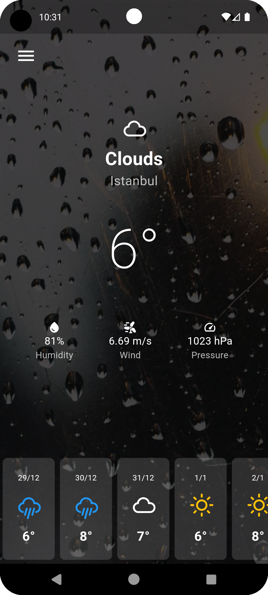
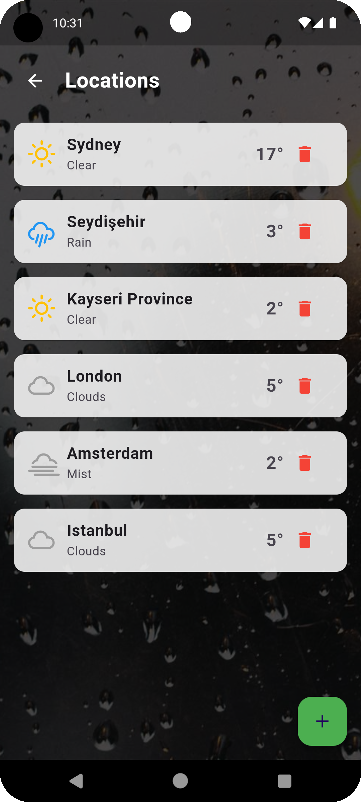

# Weather App 🌤️

This is a Flutter-based mobile application that provides real-time weather updates for selected cities. The app uses the OpenWeatherMap API to display current weather information and a 5-day forecast. It allows users to add, remove, and select cities dynamically, with persistent data storage using `SharedPreferences`.

## Features

- **Real-time Weather Data**: Current weather (Clear, Rain, Snow, etc.), temperature, humidity, wind speed, and pressure.
- **5-Day Forecast**: Detailed 5-day weather forecast with dynamic icons.
- **Dynamic City Management**: Add, remove, and set the default city.
- **Persistent Data Storage**: Saves selected cities and the last chosen city using `SharedPreferences`.
- **Responsive Design**: Optimized for both small and large screens.

## Screenshots

| Home Page                                   | City Selection Page                            |
|---------------------------------------------|-----------------------------------------------|
|       |  |

## Technologies Used

- **Flutter**: For cross-platform mobile development.
- **Dart**: Programming language for Flutter.
- **OpenWeatherMap API**: For real-time weather data.
- **SharedPreferences**: For persistent data storage.
- **Weather Icons**: To display weather-related icons dynamically.

## Installation and Usage

### Requirements

- Flutter SDK (>= 3.0.0)
- Android Studio or VS Code
- OpenWeatherMap API Key

### Steps

1. **Clone the repository**:
   ```bash
   git clone https://github.com/username/weather-app.git
   cd weather-app
   ```

2. **Install dependencies**:
   ```bash
   flutter pub get
   ```

3. **Add your API key**:
   - Open the `weather_service.dart` file and replace `YOUR_API_KEY` with your OpenWeatherMap API key:
     ```dart
     const String apiKey = "YOUR_API_KEY";
     ```

4. **Run the application**:
   ```bash
   flutter run
   ```

## File Structure

```
lib
├── main.dart                # Main application file
├── city_selection.dart      # City selection screen
├── weather_service.dart     # API service file
├── assets                   # Background images and icons
└── screenshots              # Screenshots for the README
```

## Roadmap

- **Add Weather Notifications**:
  Notify users about severe weather conditions for their selected cities.
- **Dark Mode**:
  Support for both light and dark themes.

## Contributing

1. Fork the project.
2. Create a new branch:
   ```bash
   git checkout -b feature/your-feature
   ```
3. Make your changes and commit them:
   ```bash
   git commit -m "Add your feature"
   ```
4. Push the branch:
   ```bash
   git push origin feature/your-feature
   ```
5. Open a pull request.

## License

This project is licensed under the [MIT License](LICENSE).

## Contact

- **Developer**: [Kaan Alparslan](https://github.com/Kaanalparslan)
- **Email**: cekaanalparslan@gmail.com

---

### Support

If you like this project, please give it a ⭐ and share it with others!
